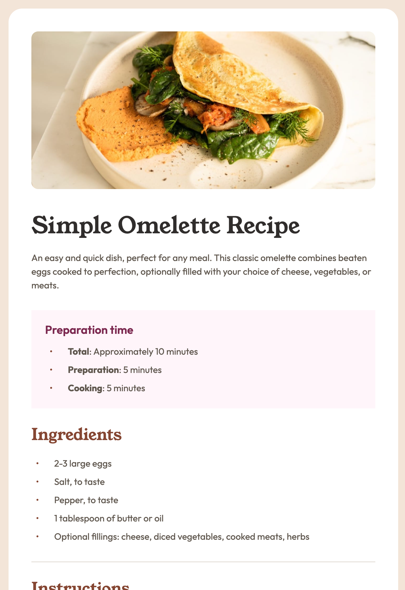

# Frontend Mentor - Recipe page solution

This is a solution to the [Recipe page challenge on Frontend Mentor](https://www.frontendmentor.io/challenges/recipe-page-KiTsR8QQKm). Frontend Mentor challenges help you improve your coding skills by building realistic projects. 

## Table of contents

- [Frontend Mentor - Recipe page solution](#frontend-mentor---recipe-page-solution)
  - [Table of contents](#table-of-contents)
  - [Overview](#overview)
    - [Screenshot (part)](#screenshot-part)
  - [My process](#my-process)
    - [Built with](#built-with)
    - [What I learned](#what-i-learned)
    - [Continued development](#continued-development)

## Overview

### Screenshot (part)



## My process

### Built with

- Semantic HTML5 markup
- CSS custom properties
- Flexbox
- CSS Grid

### What I learned

`.prettierignore` files work the same as `.gitignore`

To style `<hr>` first remove all borders then add back top or bottom. If `<hr>` is a flex child then set the `width` property.
```css
hr {
  width: 100%;
  margin: 0;
  border: none;
  border-top: solid var(--stone-150);
}
```

How to use the `calc()` CSS function:
```css
img {
  width: calc(100% - 80px);
}
```

Customize bullet points for unordered lists:
```css
ul {
  padding-left: 0px; /* Remove default padding */
  list-style: none; /* Hide the default marker */
}

ul li {
  position: relative; /* Needed for absolute positioning of the pseudo-element */
  padding-left: 24px; /* Space for the custom marker */
}

ul li::before {
  content: "•"; /* Use a bullet character or any other character */
  position: absolute;
  left: 0; /* Adjust the position as needed */
  color: red; /* Marker color */
}
```

Customize numbered list items with variable:
```css
ol {
  padding-inline-start: 0px;
  list-style: none; 
  counter-reset: list-counter; /* Initialize a counter */
}

ol li {
  position: relative;
  padding-left: 40px;
}

ol li::before {
  counter-increment: list-counter; /* Increment the counter for each item */
  content: counter(list-counter) "."; /* Display the counter value */
  position: absolute;
```

Additional notes to double check later: `::marker` pseudo-element is not rendered as a positioned box. The `position` property does not apply to markers.

There is a difference between `<b>` and `<strong>`
https://developer.mozilla.org/en-US/docs/Web/HTML/Element/strong#b_vs._strong

Save one of my todo comment just because I find it an interesting sentence :)
/*TODO Change b to strong and format li in ol as in ul*/

### Continued development

Can I put another tag before `<header>` in an `<article>`?